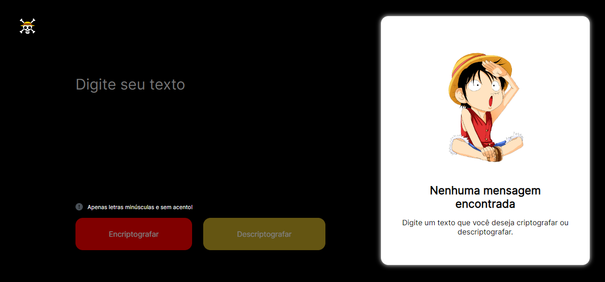

# Challenge Decodificador de Texto



## Descrição

Esse projeto foi feito com o objetivo educacional e para conclusão de formação do curso do programa ONE da oracle em colaboração com a Alura.

## Funcionalidades

- Encriptografa e descriptografa uma palavras.

## Tecnologias Utilizadas

- Html
- CSS
- Javascript

## Instalação e Execução

Siga estas etapas para rodar o projeto na sua máquina local:

1. **Clone o repositório:**

   ```bash
   https://github.com/beater27032001/DesafioTONE.git
   cd DesafioTONE

   ```

2. **Rode o aplicativo:**

     Utilize o [LiveServer](https://marketplace.visualstudio.com/items?itemName=ritwickdey.LiveServer) para abrir no seu navegador

## Acesse o Site

Você também pode acessar o aplicativo online através do link abaixo:

[Decodificador - Versão Online](https://beater27032001.github.io/DesafioTONE/)
